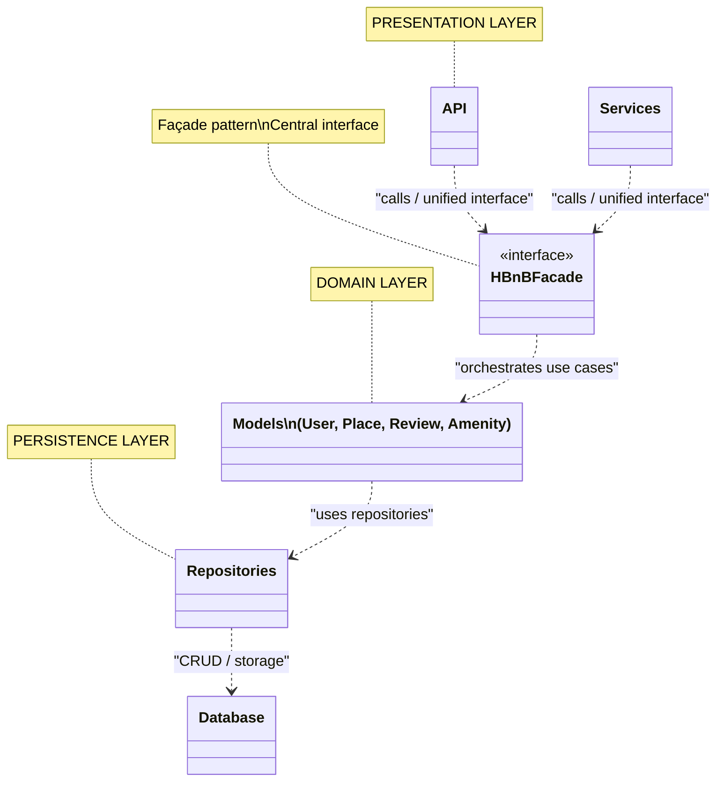
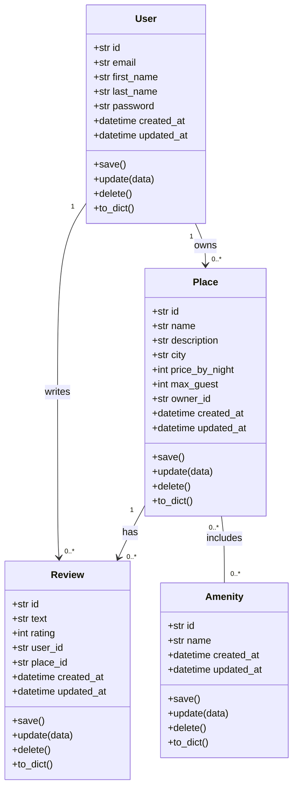
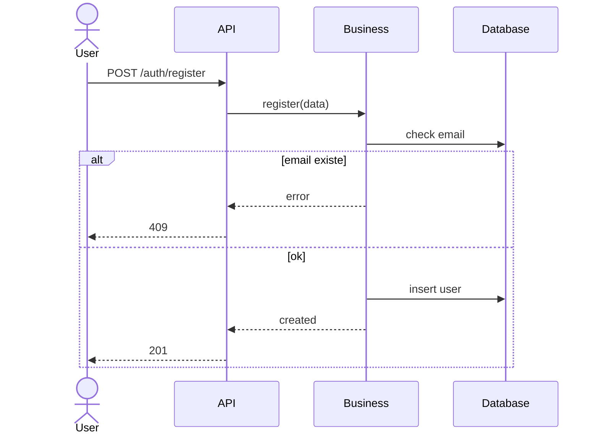
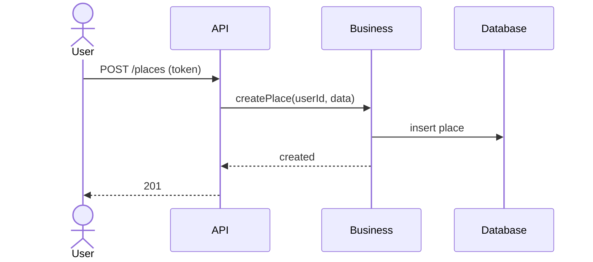
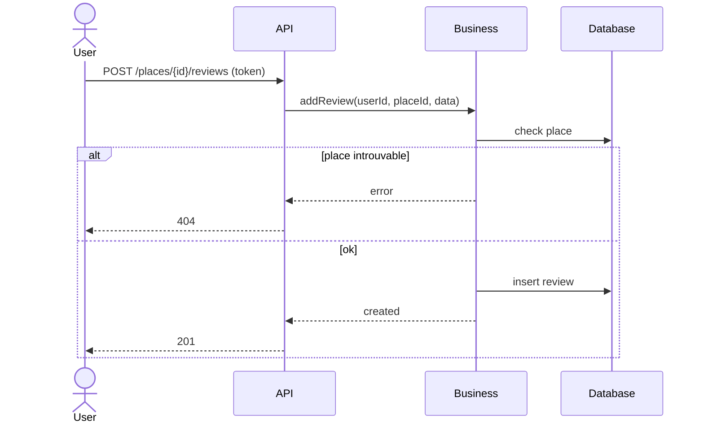
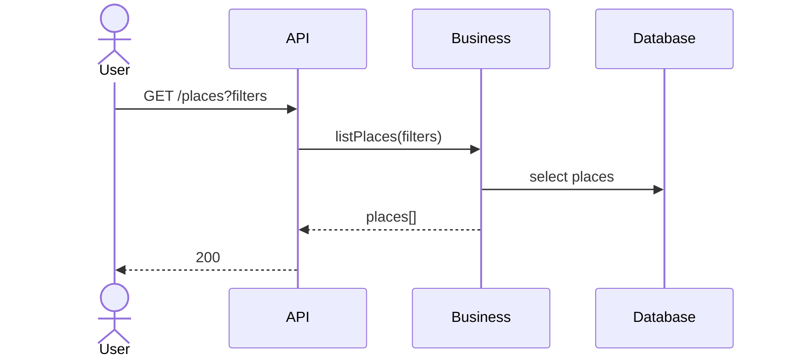

# HBnB Evolution – Technical Documentation (Part 1)

## Project Context

This repository, **holbertonschool-hbnb**, contains the comprehensive technical documentation for the
**HBnB Evolution** project – a Holberton School initiative to design and build a scalable, 
production-ready application inspired by the AirBnB platform.

**Part 1** establishes the foundational architecture and design patterns that will guide all subsequent development phases.
This phase focuses on defining the **global architecture**, establishing clear separation of concerns, 
and documenting the key design decisions. The documentation includes both high-level overviews and 
detailed domain model specifications that serve as the blueprint for implementation.

All files related to this phase are located directly inside the `part1/` directory.

---

## Part 1 Objective

The objective of this first phase is to provide a clear and structured overview of the
application architecture in order to prepare the upcoming development stages.

This documentation:
- Describes how the application is structured
- Explains how responsibilities are separated
- Introduces the communication pattern used between layers

---

## Application Overview

HBnB Evolution is a comprehensive property rental platform designed to provide a complete ecosystem for hosts 
and guests. The application enables users to:

- **Manage user accounts** – Create profiles, authenticate, and manage user information with support for both hosts and guests
- **Create and manage places** – List properties with detailed information, amenities, pricing, and availability
- **Leave reviews** – Allow guests to rate and review their experiences at properties
- **Manage amenities** – Define and categorize property amenities to help users filter and discover suitable accommodations

The architecture is designed to be modular, scalable, and maintainable, supporting future enhancements and 
additional features as the platform grows.

The detailed behavior and specific requirements for these features will be progressively defined 
in subsequent phases of the project.

---

## Architecture Overview

HBnB Evolution employs a **three-layer architecture** pattern, a well-established approach that promotes 
clean code, separation of concerns, and high maintainability. Each layer has distinct responsibilities 
and interacts with adjacent layers through well-defined interfaces:

### Layers

**Presentation Layer**  
Handles all user-facing interactions through RESTful APIs and web services. This layer is responsible 
for request validation, response formatting, and client communication. It remains agnostic to business logic 
and delegates all processing to the Business Logic Layer.

**Business Logic Layer**  
The core of the application containing all domain-specific rules, validations, and algorithms. This layer 
defines the key entities (Users, Places, Reviews, Amenities) and manages their relationships and interactions. 
It is independent of how data is persisted or presented, ensuring that business logic can be reused across 
different interfaces or storage mechanisms.

**Persistence Layer**  
Manages all data storage and retrieval operations. This layer abstracts the underlying database implementation, 
allowing the system to switch between different storage solutions (SQL, NoSQL, etc.) without impacting the 
business logic. It provides a clean interface for data access through repositories or similar patterns.

### Design Pattern: Facade

Communication between these layers is orchestrated through the **Facade design pattern**, which provides 
a unified, simplified interface for interacting with complex subsystems. This approach:
- **Prevents tight coupling** – Layers remain independent and can be modified independently
- **Simplifies interactions** – Complex internal logic is hidden behind a clean interface
- **Enhances maintainability** – Changes to one layer don't ripple through others
- **Facilitates testing** – Layers can be unit tested in isolation

---

## High-Level Package Diagram

The diagram below provides a comprehensive visual representation of the application's architecture.
It illustrates the three-layer structure of the application, the separation of concerns, and the 
communication patterns between layers through the Facade pattern. This diagram serves as the starting 
point for understanding the overall system organization and will guide the detailed design decisions 
in subsequent sections.

The editable Mermaid source for this diagram is available in `package_diagram.mmd` for future modifications.

---

## Detailed Class Diagram for Business Logic Layer

### Overview

The Business Logic Layer is the heart of the HBnB Evolution application. This layer defines all core domain entities,
their relationships, and the rules that govern their interactions. The class diagram below provides an in-depth view
of the domain model, illustrating how entities such as Users, Places, Reviews, and Amenities are structured and 
interconnected.

### Key Components

This layer encapsulates:

- **Entity Classes** – Represent core business concepts (User, Place, Review, Amenity)
- **Relationships** – Capture associations between entities (e.g., a User can host multiple Places, a Place can have multiple Reviews)
- **Validations & Business Rules** – Enforce constraints and ensure data integrity at the business level
- **Domain Logic** – Implement complex operations that involve interactions between multiple entities

### Diagram

The class diagram below visualizes the complete structure of the Business Logic Layer, showing all entities,
their attributes, methods, and relationships:

This diagram serves as the blueprint for implementation and helps developers understand the domain model
without needing to navigate the actual codebase.

---

## API Interaction Flow – Sequence Diagrams

### Overview

This section illustrates the dynamic behavior of key use cases through sequence diagrams. Each diagram 
demonstrates how different components of the system interact to fulfill specific user requests, showing 
the flow of information across the Presentation, Business Logic, and Persistence layers.

These diagrams complement the static class diagrams by providing a temporal view of the system, helping 
developers understand:
- The order of operations for each use case
- How data flows between layers
- Validation and error handling strategies
- Authentication and authorization checkpoints

### 1. User Registration

This sequence diagram illustrates the complete flow of user registration, from the initial API request 
through validation, persistence, and response. It demonstrates how the system handles duplicate email 
detection and implements secure password hashing.

**Key Points:**
- Email uniqueness validation before account creation
- Password hashing for security (never storing plain text passwords)
- Clear error handling for duplicate registrations
- Atomic transaction ensuring data consistency

### 2. Place Creation

This sequence diagram shows the authenticated process of creating a new place listing. It highlights 
the importance of authentication, data validation, and establishing ownership relationships between 
users and their properties.

**Key Points:**
- Token-based authentication verification (JWT or similar)
- Authorization check ensuring only authenticated users can create places
- Comprehensive validation of place data (name, location, coordinates, pricing)
- Automatic assignment of the authenticated user as the place owner

### 3. Review Submission

This sequence diagram demonstrates the complex business logic involved in submitting a review for a place. 
It shows multiple validation checkpoints and business rules that ensure review integrity and prevent abuse.

**Key Points:**
- Multi-step validation: authentication, data format, business rules
- Place existence verification before accepting reviews
- Duplicate review prevention (one review per user per place)
- Rating aggregation update maintaining accurate place statistics
- Transaction management ensuring consistency between review creation and rating updates
 API-->>User: 400 Bad Request
  else OK
    

### 4. Place Search and Filtering

This sequence diagram illustrates the public-facing search functionality that allows users to discover 
places using various filters, geographic queries, and sorting options. This is a key feature for user 
experience and requires efficient query handling.

**Key Points:**
- No authentication required (public search)
- Flexible query parameter validation and normalization
- Support for multiple filter types: category, full-text search, geographic radius
- Pagination support for performance and usability
- Sorting options (by price, rating, distance, relevance)
- Structured response including results and pagination metadata
    

### Design Considerations

These sequence diagrams highlight several architectural decisions:

**Error Handling Strategy**  
Each diagram demonstrates proper HTTP status code usage and early exit patterns when errors occur. 
This prevents unnecessary processing and provides clear feedback to clients.

**Layer Separation**  
Notice how each layer has distinct responsibilities:
- **Presentation Layer**: Authentication, request validation, response formatting
- **Business Logic Layer**: Business rules, domain validations, orchestration
- **Persistence Layer**: Data access, CRUD operations, query optimization

**Security First**  
Authentication checks occur at the entry point (Presentation Layer) before any business logic executes, 
following the principle of "fail fast" for security violations.

**Data Consistency**  
Operations that affect multiple entities (like review submission updating place ratings) are handled 
atomically to maintain data integrity.

## Scope of This Phase

**Part 1** of the HBnB Evolution project is specifically focused on:

- **Architectural Design** – Establishing a solid, scalable foundation using the three-layer pattern
- **Layered Organization** – Clearly separating concerns across Presentation, Business Logic, and Persistence layers
- **Design Patterns** – Implementing the Facade pattern to manage inter-layer communication
- **Domain Modeling** – Defining the core entities and their relationships in the Business Logic Layer
- **Documentation** – Creating comprehensive technical documentation that serves as the blueprint for development

### What's NOT Included in This Phase

- Implementation code or working prototypes
- Database schema or persistence logic
- API endpoint specifications or request/response examples
- Authentication and authorization details
- Deployment or DevOps configurations

### Next Steps

Additional details and implementation specifications will be introduced progressively in later phases:
- **Part 2** – API design and endpoint specifications
- **Part 3** – Database design and persistence layer implementation
- **Part 4** – Implementation of the complete application
- **Part 5** onwards – Advanced features, testing, and deployment

---

## Authors

- Lorenzo Anselme  
- Lucas Mettetal  

HBnB Evolution – Holberton School
