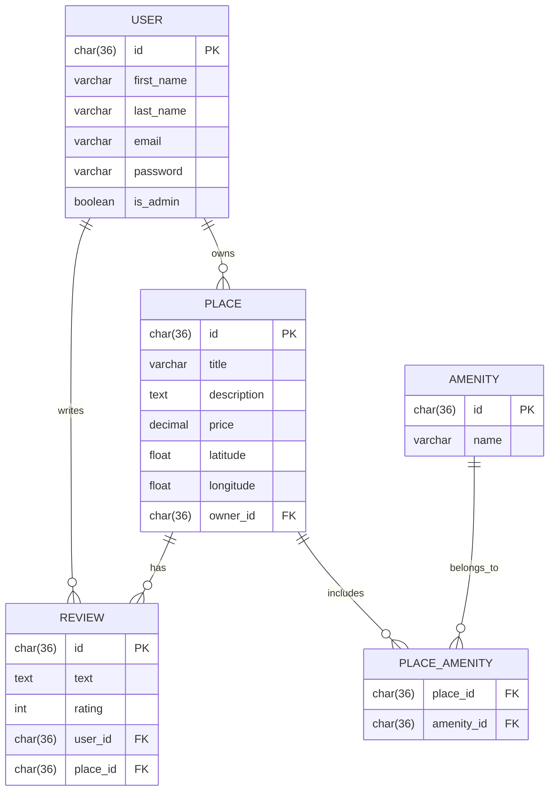

# HBnB Database ER Diagram

```mermaid
erDiagram
    USER {
        char(36) id PK
        varchar first_name
        varchar last_name
        varchar email
        varchar password
        boolean is_admin
    }

    PLACE {
        char(36) id PK
        varchar title
        text description
        decimal price
        float latitude
        float longitude
        char(36) owner_id FK
    }

    REVIEW {
        char(36) id PK
        text text
        int rating
        char(36) user_id FK
        char(36) place_id FK
    }

    AMENITY {
        char(36) id PK
        varchar name
    }

    PLACE_AMENITY {
        char(36) place_id FK
        char(36) amenity_id FK
    }

    USER ||--o{ PLACE : owns
    USER ||--o{ REVIEW : writes
    PLACE ||--o{ REVIEW : has
    PLACE ||--o{ PLACE_AMENITY : includes
    AMENITY ||--o{ PLACE_AMENITY : belongs_to
```
